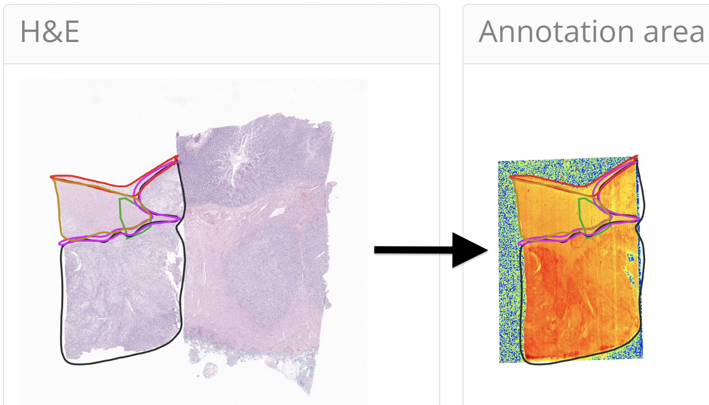

# README

## TRACE: Tissue Region Analysis through Co-registration of Elemental Maps

### Overview
TRACE is an advanced containerized web application designed for the detailed analysis of tissue regions by co-registering Whole Slide Images (WSI) with elemental maps. This tool enhances the precision of metal bioaccumulation studies by allowing targeted analysis within specific tissue areas, integrating seamlessly with hematoxylin and eosin (H&E) slides for effective comparison across various pathological conditions.

### Features
- **Detailed Elemental Profiling**: Targets specific tissue areas for precise metal bioaccumulation analysis.
- **Co-registration with WSI**: Facilitates effective comparison and analysis by integrating with H&E slides.
- **Interactive Web Application**: Includes features like real-time annotation editing, advanced statistical tools, and comprehensive data export functionalities.
- **Enhanced Spatial Analysis**: Supports the comparison of elemental abundances across annotated tissue structures and integrates with other spatial data types.

### Availability
- **Windows and Mac Applications**: [Download here](https://drive.google.com/drive/folders/1RHxua2Iog2zobPVRfJKONM5iVbDkcl3P?usp=drive_link)
- **Docker/Singularity Images**: [Access here](https://drive.google.com/drive/folders/1-Z2Y1wBx3Av6FwpxOA-W8nejnziXL7NW?usp=drive_link)
- **Tutorials for Installing and Running TRACE**:
  - [Windows (Docker)](https://youtu.be/Af3jpEx3e7s)
  - Mac (Docker) and Linux (High Performance Computer) tutorials coming soon.
- **Docker Desktop for Windows/Mac**: [Learn more](https://www.docker.com/products/docker-desktop/)

### Resources
- **Manuscript Preprint**: [Under Review](https://www.ncbi.nlm.nih.gov/pmc/articles/PMC10979873/)
- **Citations using TRACE**:
  1. Srivastava A, Shaik N, Lu Y, Chan M, Diallo A, Han S, Steiner R, Punshon T, Jackson B, Vahdat L, Vaickus L, Hoopes J, Kolling F, Marotti J, Levy J. Abstract 4949: Multimodal analysis of metals, spatial transcriptomics, and histological structures in colorectal cancer. *American Association for Cancer Research*. 2024 Mar 22;84(6_Supplement):4949.
  2. Lu Y, Steiner R, Han S, Chan M, Punshon T, Jackson B, Vahdat L, Marotti J, Levy J. Abstract 7429: A web-based application to co-register elemental imaging with histopathology to enhance the study of metal bioaccumulation within tumors. *American Association for Cancer Research*. 2024 Mar 22;84(6_Supplement):7429.
  3. Lu Y, Steiner R, Han S, Srivastava A, Shaik N, Chan M, Diallo A, Punshon T, Jackson B, Kolling F, Vahdat L, Vaickus L, Marotti J, Ho S, Levy J. Integrative Co-Registration of Elemental Imaging and Histopathology for Enhanced Spatial Multimodal Analysis of Tissue Sections through TRACE [Internet]. *bioRxiv*; 2024 [cited 2024 Apr 23]. p. 2024.03.06.583819. Available from: https://www.biorxiv.org/content/10.1101/2024.03.06.583819v1

For further documentation and updates, check out our [GitHub repository](https://github.com/jlevy44/TRACE).
